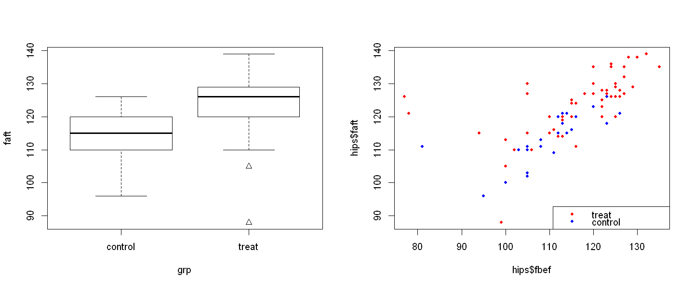
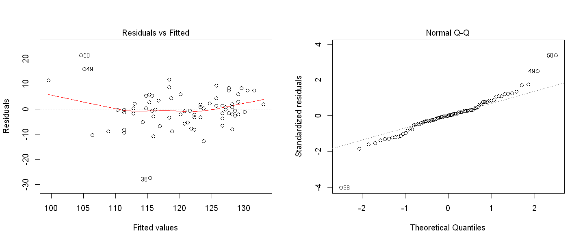
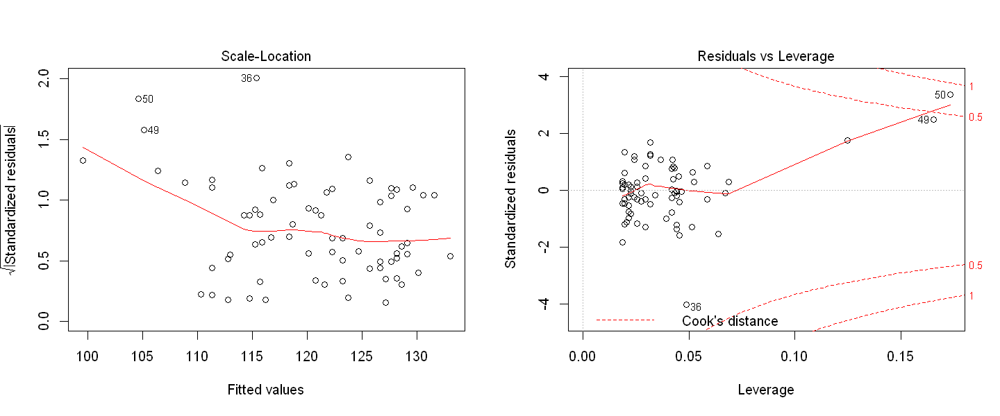
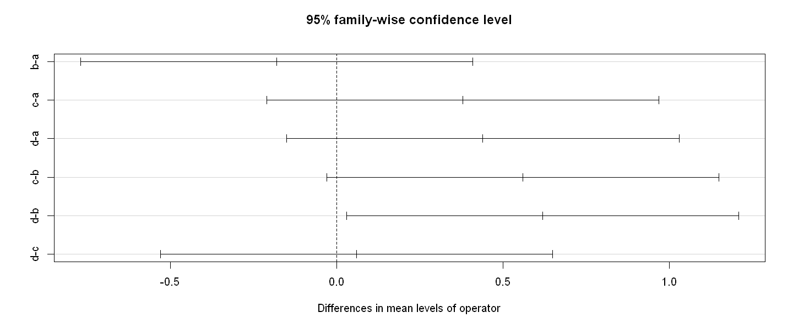

<hr style = 'height:3px'/>


```R
library (MASS)
library (dplyr)
library (faraway)
```


```R
options (repr.plot.width = 12, repr.plot.height = 5)
```

<hr style = 'height:3px'/>

# Problem 1

<font color = 'red'>
Ankylosing spondylitis is a chronic form of arthritis. A study was conducted to determine whether daily stretching of the hip tissues would improve mobility. The data are found in $hips$. The flexion angle of the hip before the study is a predictor and the flexion angle after the study is the response.


```R
data (hips)
head (hips)
```


<table>
<thead><tr><th scope=col>fbef</th><th scope=col>faft</th><th scope=col>rbef</th><th scope=col>raft</th><th scope=col>grp</th><th scope=col>side</th><th scope=col>person</th></tr></thead>
<tbody>
	<tr><td>125  </td><td>126  </td><td>25   </td><td>36   </td><td>treat</td><td>right</td><td>1    </td></tr>
	<tr><td>120  </td><td>127  </td><td>35   </td><td>37   </td><td>treat</td><td>left </td><td>1    </td></tr>
	<tr><td>135  </td><td>135  </td><td>28   </td><td>40   </td><td>treat</td><td>right</td><td>2    </td></tr>
	<tr><td>135  </td><td>135  </td><td>24   </td><td>34   </td><td>treat</td><td>left </td><td>2    </td></tr>
	<tr><td>100  </td><td>113  </td><td>26   </td><td>30   </td><td>treat</td><td>right</td><td>3    </td></tr>
	<tr><td>110  </td><td>115  </td><td>24   </td><td>26   </td><td>treat</td><td>left </td><td>3    </td></tr>
</tbody>
</table>


<font color = 'red'>
(a) Plot the data using different plotting symbols for the treatment and the control status.


```R
par (mfrow = c (1,2))
plot (faft ~ grp, hips, pch = unclass (grp))
colors <- ifelse (hips $grp == 'treat', 'red', 'blue')
plot (hips $fbef, hips $faft, col = colors, pch = 20)
legend ('bottomright', legend = c ('treat', 'control'), col = c ('red', 'blue'), pch = 20)
```


    

    


<font color = 'red'>
(b) Fit a model to determine whether there is a treatment effect.


```R
model.0 <- lm (faft ~ fbef + grp, hips)
sumary (model.0)
```

                 Estimate Std. Error t value  Pr(>|t|)
    (Intercept) 59.861413   7.772133  7.7021 4.394e-11
    fbef         0.490082   0.069486  7.0530 7.387e-10
    grptreat     7.025529   1.770852  3.9673 0.0001649
    
    n = 78, p = 3, Residual SE = 6.97649, R-Squared = 0.53
    

<font color = 'blue'>
Treatment definitely has an effect, on average treatment increases the flexion angle by 7 degrees, and this effect is statistically significant.

<font color = 'red'>
(c) Compute the difference between the flexion before and after and test whether this difference varies between treatment and control. Contrast this approach to your previous model.


```R
hips ['diff.flex'] <- hips ['faft'] - hips ['fbef']
model.1 <- lm (diff.flex ~ grp, hips)
sumary (model.1)
```

                Estimate Std. Error t value Pr(>|t|)
    (Intercept)   3.7917     1.8543  2.0448  0.04433
    grptreat      3.6898     2.2285  1.6557  0.10191
    
    n = 78, p = 2, Residual SE = 9.08399, R-Squared = 0.03
    

<font color = 'blue'>
Under this approach, we see the untreated group shows an average flexion angle improvement of 3.79 degrees, while the treatment group shows an average flexion angle improvement of 7.47 degrees. But this ignores the flexion angle prior to treatment. We try adding that back in next.


```R
model.2 <- lm (diff.flex ~ fbef + grp, hips)
sumary (model.2)
```

                 Estimate Std. Error t value  Pr(>|t|)
    (Intercept) 59.861413   7.772133  7.7021 4.394e-11
    fbef        -0.509918   0.069486 -7.3384 2.144e-10
    grptreat     7.025529   1.770852  3.9673 0.0001649
    
    n = 78, p = 3, Residual SE = 6.97649, R-Squared = 0.44
    

<font color = 'blue'>
Now, we notice that both model estimates (using the before-after approach vs difference approach) give us the same result.

<font color = 'red'>
(d) Check for outliers. Explain why we might remove the three cases with $fbef$ less than 90. Refit an appropriate model and check for a treatment effect.


```R
par (mfrow = c (1,2))
plot (model.0)
```


    

    


    

    


<font color = 'blue'>
Points 49, 50, look interesting. 49 & 50 are both high leverage and large residuals, so are influential. Notice that they correpond to the left and right hips of the same person ("person 25"). The before and after values of this person are remarkably different and do not fit our model.


```R
hips [c (49,50,70),]
```


<table>
<thead><tr><th></th><th scope=col>fbef</th><th scope=col>faft</th><th scope=col>rbef</th><th scope=col>raft</th><th scope=col>grp</th><th scope=col>side</th><th scope=col>person</th><th scope=col>diff.flex</th></tr></thead>
<tbody>
	<tr><th scope=row>49</th><td>78     </td><td>121    </td><td>35     </td><td>34     </td><td>treat  </td><td>right  </td><td>25     </td><td>43     </td></tr>
	<tr><th scope=row>50</th><td>77     </td><td>126    </td><td>30     </td><td>32     </td><td>treat  </td><td>left   </td><td>25     </td><td>49     </td></tr>
	<tr><th scope=row>70</th><td>81     </td><td>111    </td><td>14     </td><td>13     </td><td>control</td><td>left   </td><td>35     </td><td>30     </td></tr>
</tbody>
</table>


```R
model.3 <- lm (faft ~ fbef + grp, hips, subset = -c (49,50,70))
sumary (model.3)
```

                 Estimate Std. Error t value  Pr(>|t|)
    (Intercept) 25.191419   8.002650  3.1479  0.002393
    fbef         0.797341   0.071202 11.1982 < 2.2e-16
    grptreat     4.722385   1.468112  3.2166  0.001944
    
    n = 75, p = 3, Residual SE = 5.53638, R-Squared = 0.71
    

<font color = 'blue'>

We notice after removing those 3 outliers, our intercept falls by half (which accounts for the control group), and **the treatment effect also gets cut in half**.

<font color = 'red'>
(e) What is the estimated size of the treatment effect? Give a 95% confidence interval.


```R
coefficients (model.3) ['grptreat']
confint (model.3) ['grptreat',]
```


<strong>grptreat:</strong> 4.72238522609596


<dl class=dl-horizontal>
	<dt>2.5 %</dt>
		<dd>1.79575658550935</dd>
	<dt>97.5 %</dt>
		<dd>7.64901386668257</dd>
</dl>


<font color = 'blue'>
We note that the size of the treatment effect is $4.72$, with a $95\%$ confidence level at $(1.79, 7.65)$.

<font color = 'red'>
(f) Both legs of each subject have been included in the study as seperate observations. Explain what difficulties this causes with the model assumptions.

<font color = 'blue'>

Notice that each person in our study is assigned two rows. This leads to a strong correlation between those two rows. **This breaks the linear model assumption of uncorrelated, iid errors**.

<font color = 'red'>
(g) Compute the average angles for each subject and repeat the modeling with this reduced dataset. Point out any differences in the conclusions.


```R
comb.hips <- 
    hips %>%
    group_by (person, grp) %>%
    summarize (
        fbef = mean (fbef),
        faft = mean (faft),
        diff.flex = mean (diff.flex)
    )
head (comb.hips)
```


<table>
<thead><tr><th scope=col>person</th><th scope=col>grp</th><th scope=col>fbef</th><th scope=col>faft</th><th scope=col>diff.flex</th></tr></thead>
<tbody>
	<tr><td>1    </td><td>treat</td><td>122.5</td><td>126.5</td><td>4.0  </td></tr>
	<tr><td>2    </td><td>treat</td><td>135.0</td><td>135.0</td><td>0.0  </td></tr>
	<tr><td>3    </td><td>treat</td><td>105.0</td><td>114.0</td><td>9.0  </td></tr>
	<tr><td>4    </td><td>treat</td><td>122.0</td><td>124.0</td><td>2.0  </td></tr>
	<tr><td>5    </td><td>treat</td><td>124.0</td><td>130.5</td><td>6.5  </td></tr>
	<tr><td>6    </td><td>treat</td><td>117.5</td><td>120.0</td><td>2.5  </td></tr>
</tbody>
</table>


```R
model.4 <- lm (diff.flex ~ fbef + grp, comb.hips, subset = -c (25,35))
sumary (model.4)
```

                Estimate Std. Error t value Pr(>|t|)
    (Intercept) 18.19838   10.54598  1.7256  0.09349
    fbef        -0.13974    0.09384 -1.4891  0.14567
    grptreat     4.29101    1.80156  2.3818  0.02297
    
    n = 37, p = 3, Residual SE = 4.70000, R-Squared = 0.15
    

<font color = 'blue'>
We notice the big 2 changes:

- The effect of treatment is now less by $\frac {1} {2}$ degree (previously 4.7, now 4.2).
- The standard errors for both control and treatment are now larger by ~25%.

This is because we removed the effect of correlated errors, which was causing our previous regression to overfit to the data.

<hr style = 'height:3px'/>

# Problem 2

<font color = 'red'>
This problem will work with the $barley$ dataset which you can download from the $lattice$ library. This data set has $n = 120$ data points, each giving the crop yield of barley with covariates $variety$ ($10$ types), $site$ ($6$ types), and $year$ ($2$ different years).


```R
data (barley, package = 'lattice')
head (barley)
```


<table>
<thead><tr><th scope=col>yield</th><th scope=col>variety</th><th scope=col>year</th><th scope=col>site</th></tr></thead>
<tbody>
	<tr><td>27.00000       </td><td>Manchuria      </td><td>1931           </td><td>University Farm</td></tr>
	<tr><td>48.86667       </td><td>Manchuria      </td><td>1931           </td><td>Waseca         </td></tr>
	<tr><td>27.43334       </td><td>Manchuria      </td><td>1931           </td><td>Morris         </td></tr>
	<tr><td>39.93333       </td><td>Manchuria      </td><td>1931           </td><td>Crookston      </td></tr>
	<tr><td>32.96667       </td><td>Manchuria      </td><td>1931           </td><td>Grand Rapids   </td></tr>
	<tr><td>28.96667       </td><td>Manchuria      </td><td>1931           </td><td>Duluth         </td></tr>
</tbody>
</table>


<font color = 'red'>
(a) How many degrees of freedom would be used by the model will all interactions, (i.e. the regression $yield \sim variety * site * year$)? Would we be able to do significance testing on this model?


```R
model.0 <- lm (yield ~ (variety + site + year) ** 2, barley)
anova (model.0)
```


<table>
<thead><tr><th></th><th scope=col>Df</th><th scope=col>Sum Sq</th><th scope=col>Mean Sq</th><th scope=col>F value</th><th scope=col>Pr(&gt;F)</th></tr></thead>
<tbody>
	<tr><th scope=row>variety</th><td> 9          </td><td>1052.5718   </td><td> 116.95242  </td><td> 7.992713   </td><td>6.051944e-07</td></tr>
	<tr><th scope=row>site</th><td> 5          </td><td>6633.8531   </td><td>1326.77062  </td><td>90.673594   </td><td>2.417143e-22</td></tr>
	<tr><th scope=row>year</th><td> 1          </td><td> 847.2999   </td><td> 847.29988  </td><td>57.905808   </td><td>1.283059e-09</td></tr>
	<tr><th scope=row>variety:site</th><td>45          </td><td>1205.7624   </td><td>  26.79472  </td><td> 1.831193   </td><td>2.259450e-02</td></tr>
	<tr><th scope=row>variety:year</th><td> 9          </td><td> 209.7745   </td><td>  23.30828  </td><td> 1.592925   </td><td>1.464622e-01</td></tr>
	<tr><th scope=row>site:year</th><td> 5          </td><td>2102.2133   </td><td> 420.44266  </td><td>28.733713   </td><td>5.820835e-13</td></tr>
	<tr><th scope=row>Residuals</th><td>45          </td><td> 658.4572   </td><td>  14.63238  </td><td>       NA   </td><td>          NA</td></tr>
</tbody>
</table>


<font color = 'blue'>

We have to consider the combinations of single factors, two-way factors, and three-way factors.
- Single factors:
 - Year -> 2 types, hence 1 degree of freedom.
 - Site -> 6 types, hence 5 degrees of freedom.
 - Variety -> 10 types, hence 9 degrees of freedom.
- Two-way factors:
 - Year * Site -> (2-1) * (6-1) = 5 degrees of freedom.
 - Site * Variety -> (6-1) * (10-1) = 45 degrees of freedom.
 - Variety * Year -> (10-1) * (2-1) = 9 degrees of freedom.
- Three-way factors:
 - Year * Site * Variety -> (2-1) * (6-1) * (10-1) = 45 degrees of freedom.
- Total degrees of freedom
 - Intercept + Single factors + Two-way factors + Three-way factors
 - 1 + (1 + 5 + 9) + (5 + 45 + 9) + 45 = 120

This leaves us with **no degrees of freedom** for the residuals! We would not be able to do significance testing using this model.

<font color = 'red'>
(b) How many d.f. would be used by the model with all factors and two-way interactions, but not three-way interactions, (i.e. the regression $yield \sim (variety + site + year) * 2)$? For both this part and the part above, show your d.f. calculation by hand, not by running the model in R.

<font color = 'blue'>

This is slightly similar to the previous discussion, except we can drop the three-way interactions.
- Single factors:
 - Year -> 2 types, hence 1 degree of freedom.
 - Site -> 6 types, hence 5 degrees of freedom.
 - Variety -> 10 types, hence 9 degrees of freedom.
- Two-way factors:
 - Year * Site -> (2-1) * (6-1) = 5 degrees of freedom.
 - Site * Variety -> (6-1) * (10-1) = 45 degrees of freedom.
 - Variety * Year -> (10-1) * (2-1) = 9 degrees of freedom.
- Total degrees of freedom
 - Intercept + Single factors + Two-way factors
 - 1 + (1 + 5 + 9) + (5 + 45 + 9) = 75

Dropping the three-way interactions, leaves us with **45 degrees of freedom** for the residuals. This is sufficient for us to perform significance testing on this model.

<font color = 'red'>
(c) From this point on, we will use the data set with data points $23$ and $83$ removed (these are identified as outliers, perhaps mistaken data entry, by your textbook), so your sample size is now $118$. Run the model with all two-way interactions, $yield \sim (variety + site + year) * 2$. Use ANOVA to check each of the two-way interactions for significance at the $0.05$ level, removing them one at a time if appropriate. Show your R code/output as you perform each step of this procedure.


```R
model.1 <- lm (yield ~ (variety + site + year) ** 2, barley, subset = -c (23,83))
anova (model.1)
```


<table>
<thead><tr><th></th><th scope=col>Df</th><th scope=col>Sum Sq</th><th scope=col>Mean Sq</th><th scope=col>F value</th><th scope=col>Pr(&gt;F)</th></tr></thead>
<tbody>
	<tr><th scope=row>variety</th><td> 9          </td><td>1029.5833   </td><td> 114.39814  </td><td>  9.893541  </td><td>4.271346e-08</td></tr>
	<tr><th scope=row>site</th><td> 5          </td><td>6607.1275   </td><td>1321.42550  </td><td>114.281384  </td><td>4.722542e-24</td></tr>
	<tr><th scope=row>year</th><td> 1          </td><td> 912.0998   </td><td> 912.09977  </td><td> 78.881499  </td><td>2.270574e-11</td></tr>
	<tr><th scope=row>variety:site</th><td>44          </td><td>1161.7821   </td><td>  26.40414  </td><td>  2.283520  </td><td>3.615300e-03</td></tr>
	<tr><th scope=row>variety:year</th><td> 9          </td><td> 189.8565   </td><td>  21.09517  </td><td>  1.824382  </td><td>9.059285e-02</td></tr>
	<tr><th scope=row>site:year</th><td> 5          </td><td>2164.7005   </td><td> 432.94010  </td><td> 37.442137  </td><td>8.766839e-15</td></tr>
	<tr><th scope=row>Residuals</th><td>44          </td><td> 508.7681   </td><td>  11.56291  </td><td>        NA  </td><td>          NA</td></tr>
</tbody>
</table>


<font color = 'blue'>

We note that $variety{:}year$ shows low significance at the 0.05 level. We try removing that first.


```R
model.1 <- lm (yield ~ (variety + site + year) ** 2 - variety:year, barley, subset = -c (23,83))
anova (model.1)
```


<table>
<thead><tr><th></th><th scope=col>Df</th><th scope=col>Sum Sq</th><th scope=col>Mean Sq</th><th scope=col>F value</th><th scope=col>Pr(&gt;F)</th></tr></thead>
<tbody>
	<tr><th scope=row>variety</th><td> 9          </td><td>1029.5833   </td><td> 114.39814  </td><td>  8.671573  </td><td>7.427195e-08</td></tr>
	<tr><th scope=row>site</th><td> 5          </td><td>6607.1275   </td><td>1321.42550  </td><td>100.166289  </td><td>9.375477e-26</td></tr>
	<tr><th scope=row>year</th><td> 1          </td><td> 912.0998   </td><td> 912.09977  </td><td> 69.138706  </td><td>3.524963e-11</td></tr>
	<tr><th scope=row>variety:site</th><td>44          </td><td>1161.7821   </td><td>  26.40414  </td><td>  2.001478  </td><td>8.104318e-03</td></tr>
	<tr><th scope=row>site:year</th><td> 5          </td><td>2164.1323   </td><td> 432.82645  </td><td> 32.808977  </td><td>4.377340e-15</td></tr>
	<tr><th scope=row>Residuals</th><td>53          </td><td> 699.1928   </td><td>  13.19232  </td><td>        NA  </td><td>          NA</td></tr>
</tbody>
</table>


<font color = 'blue'>

We observe that no other variables appear insignificant anymore, and we decide to keep this model.

<hr style = 'height:3px'/>

# Problem 3

<font color = 'red'>
Pairwise comparisons. The $pulp$ data set (from faraway) contains $20$ data points, $5$ each in groups $A$, $B$, $C$, $D$. The response $bright$ is paper brightness and the covariate $operator$ is some treatment applied during paper production, either $A$ or $B$ or $C$ or $D$. We will investigate whether there are significant differences between any pair, e.g. brightness is significantly higher for production method $A$ than for $D$, or statements of this type.


```R
data (pulp, package = 'faraway')
head (pulp)
```


<table>
<thead><tr><th scope=col>bright</th><th scope=col>operator</th></tr></thead>
<tbody>
	<tr><td>59.8</td><td>a   </td></tr>
	<tr><td>60.0</td><td>a   </td></tr>
	<tr><td>60.8</td><td>a   </td></tr>
	<tr><td>60.8</td><td>a   </td></tr>
	<tr><td>59.8</td><td>a   </td></tr>
	<tr><td>59.8</td><td>b   </td></tr>
</tbody>
</table>


<font color = 'red'>
(a) Begin by calculating the sample mean of $bright$ in each group, $\hat \alpha_A$, $\hat \alpha_B$, $\hat \alpha_C$, $\hat \alpha_D$.


```R
group.means <- pulp %>% group_by (operator) %>% summarize (mean = mean (bright))
group.means
```


<table>
<thead><tr><th scope=col>operator</th><th scope=col>mean</th></tr></thead>
<tbody>
	<tr><td>a    </td><td>60.24</td></tr>
	<tr><td>b    </td><td>60.06</td></tr>
	<tr><td>c    </td><td>60.62</td></tr>
	<tr><td>d    </td><td>60.68</td></tr>
</tbody>
</table>


<font color = 'blue'>
We observe our manual calculation matches the coefficients output from $lm$.


```R
model.0 <- lm (bright ~ operator, pulp)
lm.coef <- data.frame (coefficients (summary (model.0)) [,'Estimate'])
data.frame (Alpha = rbind (
    A = lm.coef ['(Intercept)',],
    B = lm.coef ['(Intercept)',] + lm.coef ['operatorb',],
    C = lm.coef ['(Intercept)',] + lm.coef ['operatorc',],
    D = lm.coef ['(Intercept)',] + lm.coef ['operatord',]
))
```


<table>
<thead><tr><th></th><th scope=col>Alpha</th></tr></thead>
<tbody>
	<tr><th scope=row>A</th><td>60.24</td></tr>
	<tr><th scope=row>B</th><td>60.06</td></tr>
	<tr><th scope=row>C</th><td>60.62</td></tr>
	<tr><th scope=row>D</th><td>60.68</td></tr>
</tbody>
</table>


<font color = 'red'>
(b) Next calculate $\hat \sigma$, assuming that each observation is normally distributed as $Y_i \sim N (\alpha ..., \sigma^2)$ (where $...$ denotes the group, $A$ or $B$ or $C$ or $D$, that data point $i$ is assigned to).


```R
sum.sq <- function (x) sum ((x - mean (x)) ^ 2)
errors <- pulp %>% group_by (operator) %>% summarize (sse = sum.sq (bright))
sqrt (sum (errors ['sse']) / (20-4))
```


0.325960120260133


<font color = 'blue'>
We see that the calculated $\hat \sigma = 0.32596$ (note that we divide by $N-p$, where $N = 20$, and $p = 4$) matches the regression supplied value.


```R
summary (model.0) $sigma
```


0.325960120260129


<font color = 'red'>
(c) Supposing that $\sigma$ were known, what’s the square root of the variance of $\hat \alpha_A - \hat \alpha_B$ in terms of $\sigma$? Now plug in $\hat \sigma$ in place of $\sigma$, this is now the standard error, $SE (\hat \alpha_A - \hat \alpha_B)$. Repeat for every possible pairwise comparison.

<font color = 'blue'>

If we knew $\sigma$, we could just plug it in directly in our formula.

$
SE (\hat \alpha_i - \hat \alpha_j) \\
= \sigma \sqrt {\dfrac {1} {J_i} + \dfrac {1} {J_j}} \\
= \sigma \sqrt {\dfrac {2} {J}} \\
\text {Since, } J_i = J_k \forall i,j \in \mathbb {R} \text { in our dataset} \\
$

<font color = 'blue'>

Plugging in $\hat \sigma$ in place of $\sigma$, we get;

$
SE (\hat \alpha_i - \hat \alpha_j) \\
= \hat \sigma \sqrt {\dfrac {2} {J}} \\
= 0.32596 * \sqrt {\dfrac {2} {5}} \\
= 0.2061 \forall i,j \in \mathbb {R} \\
$

<font color = 'red'>
(d) Finally, calculate the Tukey honest significant difference (Tukey HSD) confidence interval for each possible pairwise comparison. At the 0.05 level, what conclusions can you draw about the four production methods?


```R
tci <- TukeyHSD (aov (bright ~ operator, pulp))
tci
```


      Tukey multiple comparisons of means
        95% family-wise confidence level
    
    Fit: aov(formula = bright ~ operator, data = pulp)
    
    $operator
         diff         lwr       upr     p adj
    b-a -0.18 -0.76981435 0.4098143 0.8185430
    c-a  0.38 -0.20981435 0.9698143 0.2903038
    d-a  0.44 -0.14981435 1.0298143 0.1844794
    c-b  0.56 -0.02981435 1.1498143 0.0657945
    d-b  0.62  0.03018565 1.2098143 0.0376691
    d-c  0.06 -0.52981435 0.6498143 0.9910783
    


```R
plot (tci)
```


    

    


<font color = 'blue'>
Conclusions we can draw - Almost all iterations of $\hat \alpha_i - \hat \alpha_j$ contain zero, so we can assert they are not significantly different. With the exception of $\hat \alpha_D - \hat \alpha_B$ which is certainly significantly different.

<hr style = 'height:3px'/>

# Problem 4

<font color = 'red'>

Suppose that combinations of three drugs, called $A$ and $B$ and $C$, are being examined for their ability to lower blood pressure. Suppose that, without any medication, expected systolic blood pressure (the response $Y$) in the population being studied is $150$. Any one drug on its own has no effect on blood pressure.

However, drug $A$ in combination with $B$ or $C$ will reduce blood pressure to $140$. Drugs $B$ and $C$ are chemically very similar and it doesn’t matter which one is used in combination with drug $A$. There’s no benefit to using both -- it’s equivalent to just using one.

Now suppose we want to write down a linear model, using treatment coding, to describe this scenario. What are the values of all the coefficients in the model?
- The intercept term $\beta_0$.
- The one-way terms $\beta_A$, $\beta_B$, $\beta_C$.
- If needed, the two-way interaction terms $\beta_{A:B}$, $\beta_{B:C}$, $\beta_{C:A}$.
- If needed, the three-way interaction term $\beta_{A:B:C}$.

<font color = 'blue'>

- $\beta_0$ corresponds to the no-treatment group mean, $\beta_0 = 150$.
- The two-way interaction terms **inclusive of $A$** will be the difference between the no-treatment group mean and the treatment group mean. $\\ \beta_{A:B} = \beta_{C:A} = 140 - 150 = -10$
- The remaining two-way interaction term will be zero, $\beta_{B:C} = 0$.
- The three-way interaction term will need to offset one of the two-way terms $\beta_{A:B}$ & $\beta_{C:A}$ being non-zero. $\\ \beta_{A:B:C} = +10$
- All one-way interaction terms will be zero, $\beta_A = \beta_B = \beta_C = 0$.


```R
data.frame (
    Betas = c (  0, 'A', 'B', 'C', 'A:B', 'B:C', 'C:A', 'A:B:C'),
    Value = c (150,  0 ,  0 ,  0 ,  -10 ,   0  ,  -10 ,   10   )
)
```


<table>
<thead><tr><th scope=col>Betas</th><th scope=col>Value</th></tr></thead>
<tbody>
	<tr><td>0    </td><td>150  </td></tr>
	<tr><td>A    </td><td>  0  </td></tr>
	<tr><td>B    </td><td>  0  </td></tr>
	<tr><td>C    </td><td>  0  </td></tr>
	<tr><td>A:B  </td><td>-10  </td></tr>
	<tr><td>B:C  </td><td>  0  </td></tr>
	<tr><td>C:A  </td><td>-10  </td></tr>
	<tr><td>A:B:C</td><td> 10  </td></tr>
</tbody>
</table>


<hr style = 'height:3px'/>

# Problem 5

<font color = 'red'>

Consider a hypothetical study on young children’s reading skills. Suppose the following variables are measured:
- Response Y = reading ability (a continuous score)
- S = school that the child attends (levels 0, 1, 2 indicating which of three different schools)
- I = parents’ annual income (continuous, in units of $1000)
- T = teacher training, indicating whether the teacher participated in an experimental training program (level 0 = no, level 1 = yes)

Here is some R output for the model that includes all two-way interactions (some fields are covered with XXX to hide the output):

```
> anova (lm (Y ~ (I + S + T) ** 2))
Analysis of Variance Table

Response: Y
            Df   SumSq  MeanSq     Fvalue  Pr(>F)
I          XXX  10,529     XXX   274.1793  < 2.2e-16 ***
S          XXX  35,560     XXX   462.9996  < 2.2e-16 ***
T          XXX   1,262     XXX    32.8556  2.782e-07 ***
I:S        XXX   2,422     XXX    31.5326  2.680e-10 ***
I:T        XXX       2     XXX     0.0630  0.8026
S:T        XXX      93     XXX     1.2054  0.3062
Residuals   65   2,496    38.4000
---
Signif. codes: 0 `***' 0.001 `**' 0.01 `*' 0.05 `.' 0.1 ` ' 1
```

<font color = 'red'>
(a) Compute the sample size of this study.

<font color = 'blue'>
We have 65 residuals after accounting for 6 terms (and 1 unlisted intercept term). Hence, $sample \ size = 65 + 7 = 72$.

<font color = 'red'>
(b) You decide to compare to the model with no interaction terms and see the following R output:

```
> anova (lm (Y ~ (I + S + T)))
Analysis of Variance Table
Response: Y
           Df  SumSq  MeanSq  Fvalue     Pr(>F)
I         XXX  10,529   XXX   147.025 < 2.2e-16 ***
S         XXX  35,560   XXX   248.278 < 2.2e-16 ***
T         XXX   1,262   XXX    17.618   7.8e-05 ***
Residuals XXX   5,013   XXX
---
Signif. codes: 0 `***' 0.001 `**' 0.01 `*' 0.05 `.' 0.1 ` ' 1
```

We want to test the larger model, $lm (Y ~ (I + S + T) * 2)$, against the reduced model, $lm (Y ~ I + S + T)$. Compute the F statistic for the test, and the two degrees-of-freedom for this F statistic (i.e., the null distribution is the $F_{?,?}$ distribution).

<font color = 'blue'>

$
\text {F-number} = \dfrac {RSS_{\Omega} - RSS_{\omega}} {RSS_{\Omega}} . \dfrac {df_{\Omega}} {df_{\Omega} - df_{\omega}} \\
= \dfrac {5013 - 2496} {5013} . \dfrac {68} {68 - 65} \\
= 11.381 \\
\text {F-statistic} = 1 - pf (\text {F-number}, df_1, df_2, \text {lower.tail} = F) \\
= 1 - pf (11.381, 68 - 65, 68, lower.tail = F) \\
= 0.999 \\
\text {[ Null distribution is } F_{3,68} \text {]} \\
F_{3,68} = 0.999 \\
$

<font color = 'red'>

(c) After removing some interactions that don’t appear significant, you run the regression $lm (Y ~ I + S + T + I:S)$, and see the following output:

```
> summary (lm (Y ~ I + S + T + I:S))
...
Coefficients:
             Estimate Std.Error tvalue   Pr(>|t|)
(Intercept)  43.59154   3.57545  12.192  < 2e-16 ***
I             0.35624   0.03802   9.370  7.2e-14 ***
S2          -15.53955   5.00881  -3.102  0.00279 **
S3           -5.69880   4.94939  -1.151  0.25359
T            10.34740   1.57472   6.571  8.3e-09 ***
I:S2         -0.34006   0.05661  -6.008  8.2e-08 ***
I:S3          0.09943   0.05428   1.832  0.07137 .
---
```

You notice that the coefficient on I and the coefficient on $I:S2$ nearly cancel out, i.e. $\beta_I \approx - \beta_{I:S2}$. How can we interpret this? Your answer should be short and should refer to the original meaning of the variables in the context of the problem.

<font color = 'blue'>

$
Y = \beta_0 + \beta_I I + \beta_{S=2} \mathbb {1}_{S=2} + \beta_{S=3} \mathbb {1}_{S=3} + \beta_T T + \beta_{I{:}S=2} I \mathbb {1}_{S=2} + \beta_{I{:}S=3} I \mathbb {1}_{S=3} \\
\text {When } S = 2, \\
\mathbb {1}_{S=2} = 1, \text { and } \mathbb {1}_{S=3} = 0 \\
\begin {align*}
\implies Y &= \beta_0 + \beta_I I + \beta_{S=2} + \beta_T T + \beta_{I{:}S=2} I \\
&= (\beta_0 + \beta_{S=2}) + \beta_T T + (\beta_I + \beta_{I{:}S=2}) I \\
\end {align*} \\
\text {Given } \beta_I \approx -\beta_{I{:}S=2}, \\
\implies Y = (\beta_0 + \beta_{S=2}) + \beta_T T \\
$

<font color = 'blue'>
This tells us that if a student goes to school 2, then parent's income plays no role in determining the outcome reading level. Effectively, parent's income level does not affect the response variable $Y$.

<hr style = 'height:3px'/>
